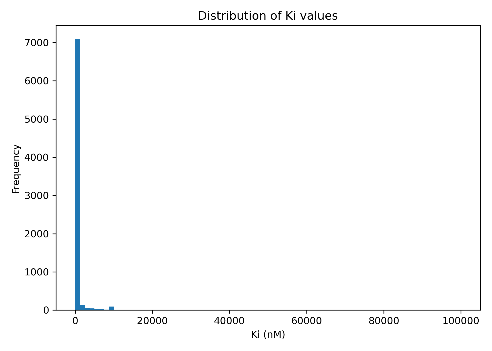
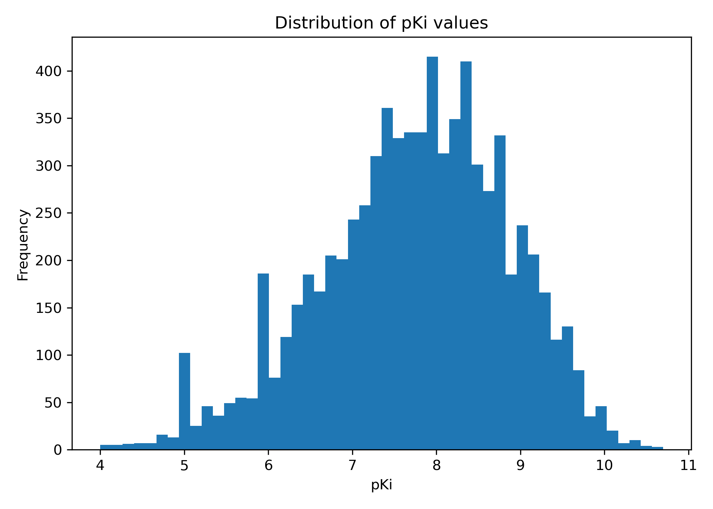
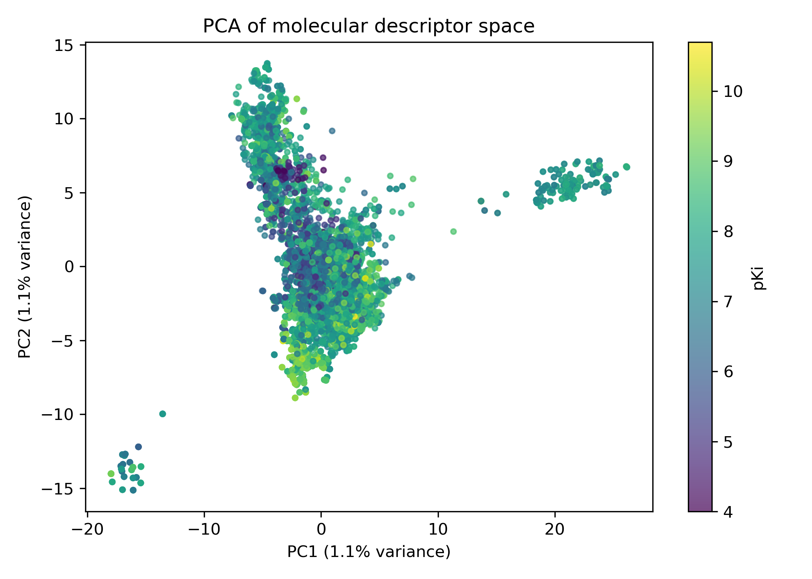
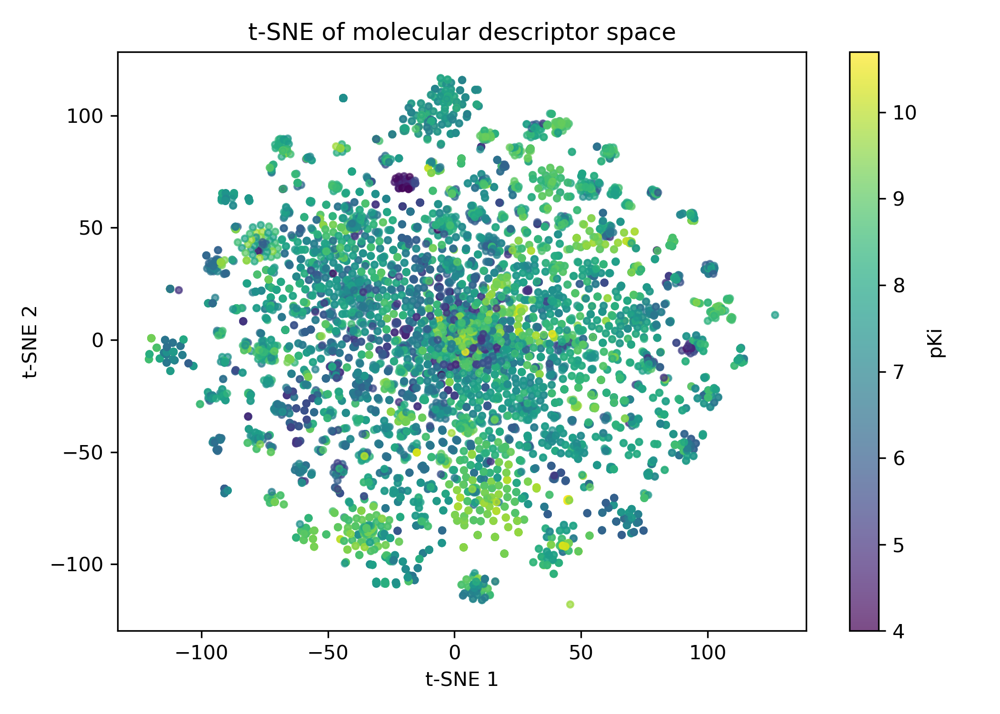
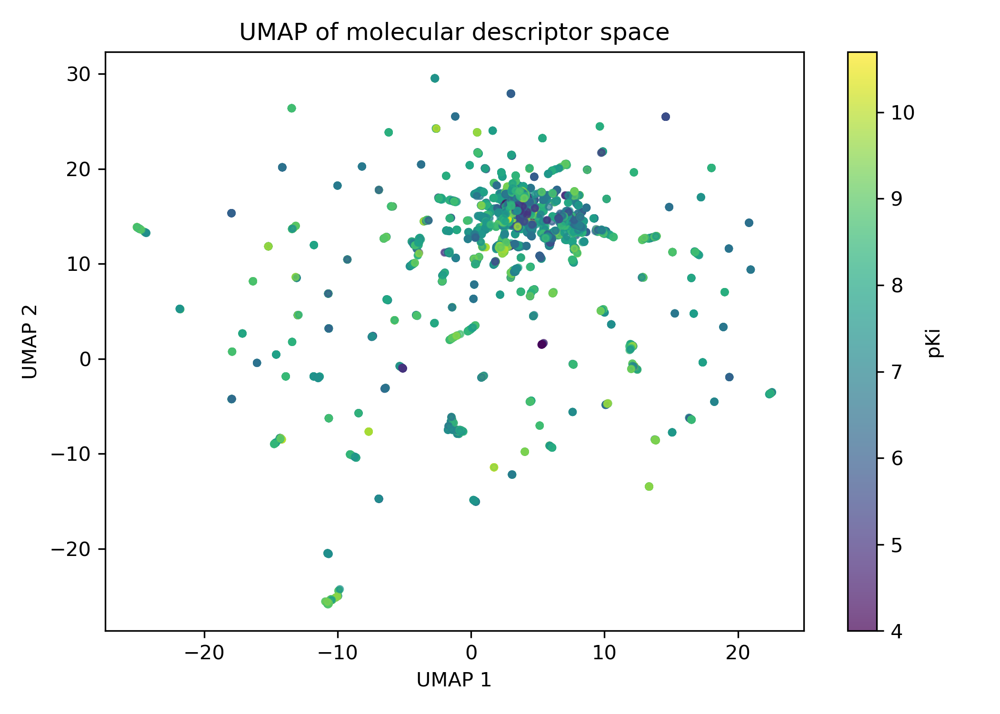
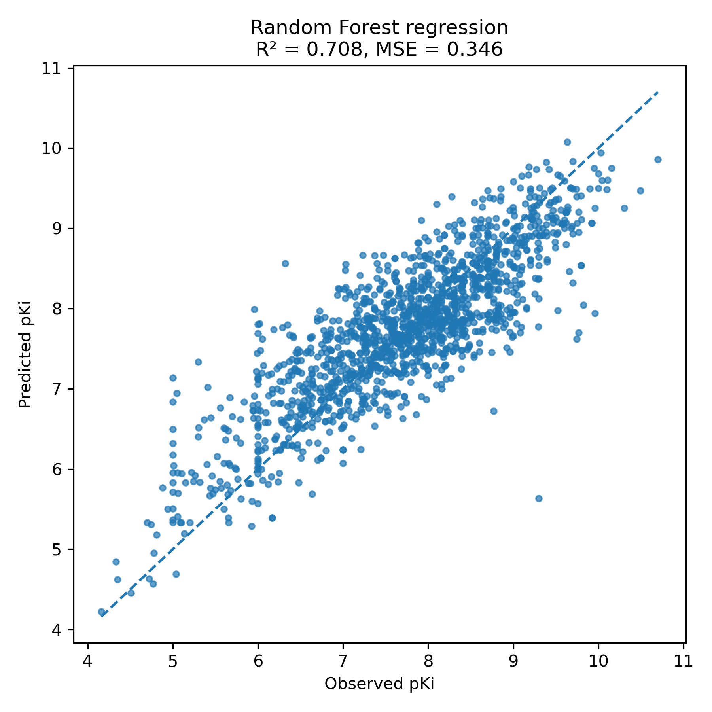
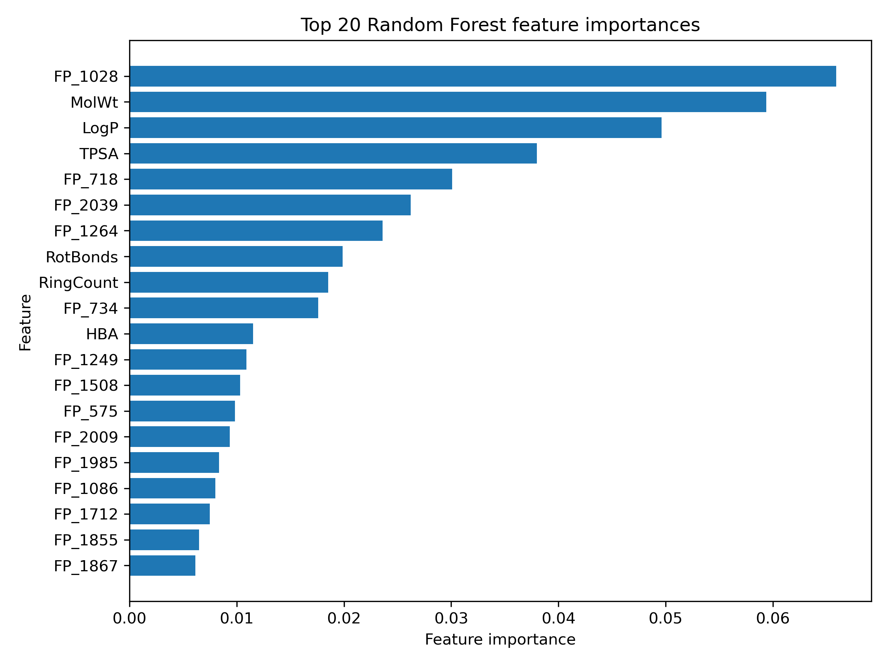
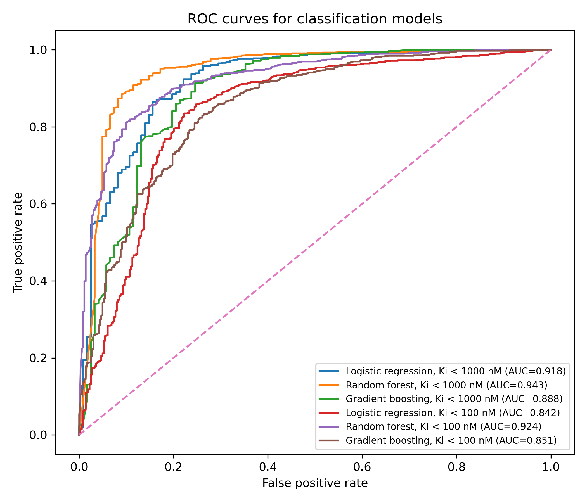

# Bioactivity Prediction

Computational analysis of small-molecule bioactivity using chemical descriptors, dimensionality reduction, and machine learning models.

## Project overview

This project analyses a dataset of small molecules with experimentally measured Ki values. The workflow includes activity data exploration, pKi transformation, molecular descriptor generation, descriptor-space visualisation, regression modelling, classification modelling, model evaluation, feature importance analysis, and Random Forest hyperparameter tuning.

The workflow was developed during postgraduate training in applied pharmaceutical bioinformatics at Uppsala University, Sweden.

## Analysis workflow

1. Inspect raw molecular activity data
2. Transform Ki values to pKi
3. Filter extreme non-physical outliers
4. Generate RDKit physicochemical descriptors
5. Generate ECFP4/Morgan fingerprints
6. Visualise descriptor space using PCA, t-SNE, and UMAP
7. Train and compare regression models using 10-fold cross-validation
8. Train and compare classification models using two activity thresholds
9. Evaluate model performance using appropriate regression and classification metrics
10. Analyse Random Forest feature importance
11. Assess Random Forest hyperparameters using GridSearchCV
12. Automate the workflow using Snakemake

## Repository structure

~~~text
bioactivity-prediction/
├── data/
│   ├── raw/
│   └── processed/
├── scripts/
├── results/
│   ├── figures/
│   └── tables/
├── report/
├── Snakefile
├── environment.yml
└── README.md
~~~

## Environment

Create and activate the conda environment:

~~~bash
conda env create -f environment.yml
conda activate bioactivity-prediction
~~~

## Run the workflow

Dry run:

~~~bash
snakemake -n
~~~

Run the full workflow:

~~~bash
snakemake --cores 4
~~~

Force regeneration of all outputs:

~~~bash
snakemake --cores 4 --forceall
~~~

## Data preprocessing

Raw Ki values were highly right-skewed and spanned several orders of magnitude. Ki values were therefore transformed into pKi values:

~~~text
pKi = -log10(Ki in M)
~~~

Extreme non-physical activity values were filtered before descriptor generation and modelling to reduce distortion of model training and descriptor-space visualisation.

## Molecular descriptors

Two complementary descriptor groups were generated.

### RDKit physicochemical descriptors

- Molecular weight
- LogP
- TPSA
- Hydrogen bond acceptors
- Hydrogen bond donors
- Rotatable bonds
- Ring count

These descriptors capture global molecular properties relevant to molecular recognition, solubility, polarity, flexibility, and binding behaviour.

### ECFP4 / Morgan fingerprints

- Radius: 2
- Fingerprint length: 2048 bits

Morgan fingerprints encode local substructural environments and allow machine learning models to capture nonlinear structure-activity relationships.

## Dimensionality reduction

Descriptor space was explored using:

- PCA
- t-SNE
- UMAP

These methods were used to assess structural diversity, clustering behaviour, and possible separation between activity regions.

## Results figures

### Raw Ki distribution

### pKi distribution

### PCA descriptor space

### t-SNE descriptor space

### UMAP descriptor space

### Random Forest regression: predicted versus observed pKi

### Random Forest feature importance

### ROC curves for classification models

## Regression modelling

Regression models were evaluated using 10-fold cross-validation.

Models compared:

- Ridge Regression
- Random Forest Regressor
- Gradient Boosting Regressor

Metrics reported:

- R²
- Mean squared error

Output table:

~~~text
results/tables/regression_metrics.csv
~~~

Random Forest regression achieved the strongest performance, suggesting that nonlinear descriptor interactions contributed substantially to bioactivity prediction.

## Classification modelling

Classification was evaluated using two activity thresholds:

- Ki < 1000 nM
- Ki < 100 nM

Models compared:

- Logistic Regression
- Random Forest Classifier
- Gradient Boosting Classifier

Metrics reported:

- ROC-AUC
- Precision
- Recall
- F1-score

Output tables:

~~~text
results/tables/classification_metrics.csv
results/tables/roc_auc_test_results.csv
~~~

The Ki < 1000 nM threshold produced a highly imbalanced classification task, whereas the Ki < 100 nM threshold produced a stricter and more challenging activity definition.

## Hyperparameter tuning

A lightweight GridSearchCV analysis was performed for Random Forest models using a 3000-compound subset.

Tuned parameters:

- n_estimators
- max_depth
- min_samples_leaf

Output tables:

~~~text
results/tables/random_forest_regression_tuning.csv
results/tables/random_forest_classification_tuning.csv
~~~

The best configuration supported the use of 300 trees, unrestricted tree depth, and a minimum leaf size of 1 in the main Random Forest analyses.

## Interpretation summary

The results indicate that molecular bioactivity prediction benefited from combining physicochemical descriptors with fingerprint-based substructural representations.

Random Forest models consistently outperformed linear models in both regression and classification tasks, supporting the presence of nonlinear relationships between molecular structure and biological activity.

Classification performance depended strongly on the chosen activity threshold. The Ki < 1000 nM threshold produced strong apparent classification performance but also substantial class imbalance. The Ki < 100 nM threshold was more stringent and provided a more challenging classification task.

Metric interpretation therefore required consideration of class balance, precision, recall, and ROC-AUC together, rather than relying on a single metric.

## Main output files

### Tables

~~~text
results/tables/activity_summary.csv
results/tables/regression_metrics.csv
results/tables/classification_metrics.csv
results/tables/roc_auc_test_results.csv
results/tables/random_forest_feature_importance.csv
results/tables/random_forest_regression_tuning.csv
results/tables/random_forest_classification_tuning.csv
~~~

### Figures

~~~text
results/figures/ki_distribution_raw.png
results/figures/pki_distribution.png
results/figures/pca_descriptor_space.png
results/figures/tsne_descriptor_space.png
results/figures/umap_descriptor_space.png
results/figures/random_forest_predicted_vs_observed.png
results/figures/random_forest_feature_importance.png
results/figures/roc_curves_classification.png
~~~
